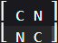
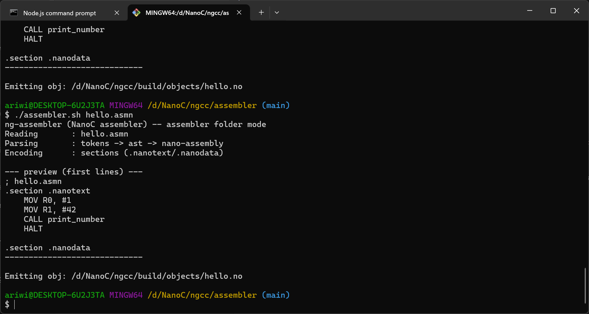
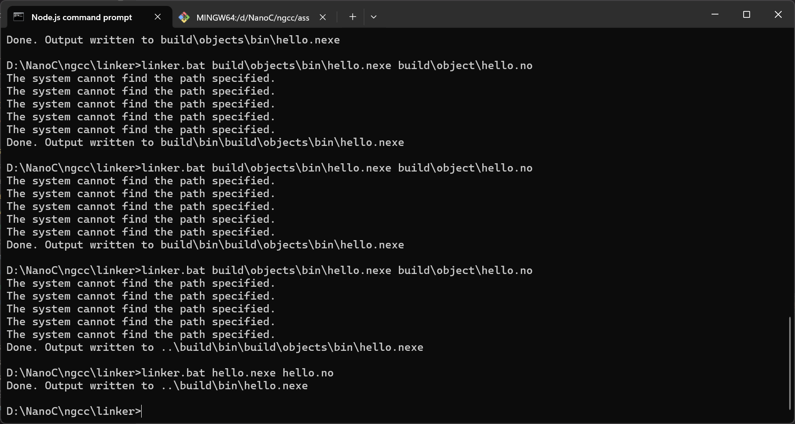
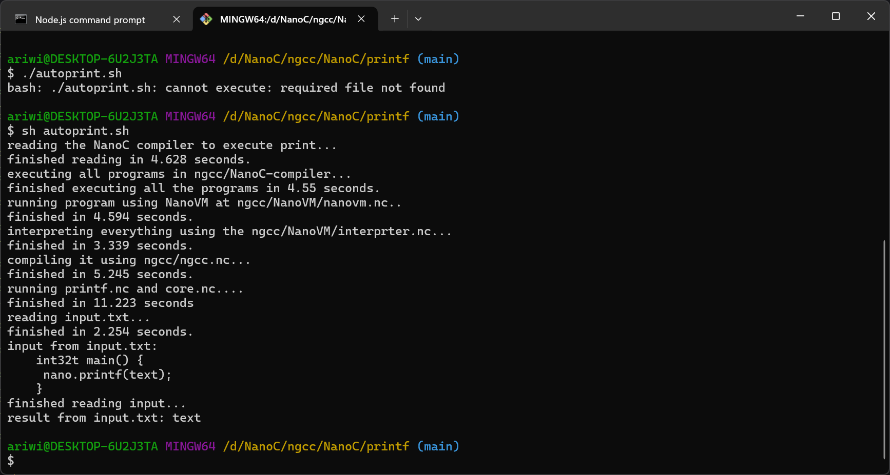
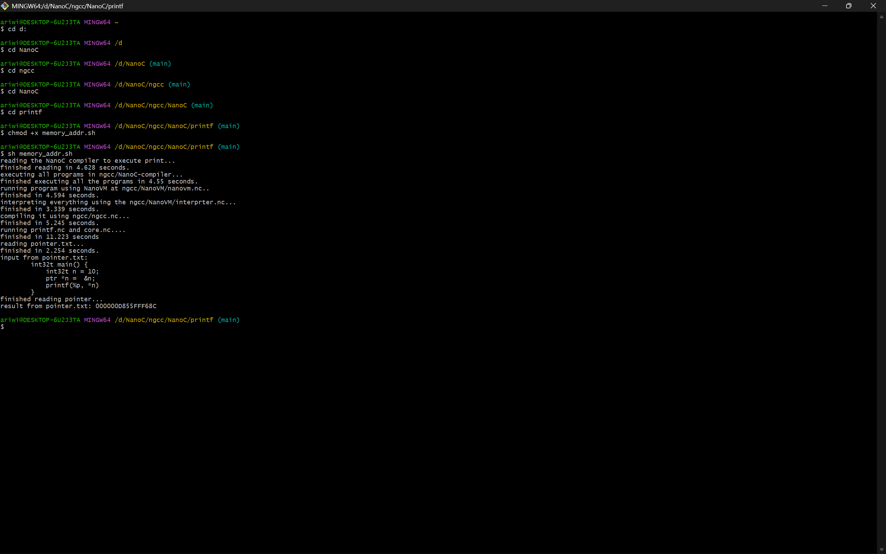
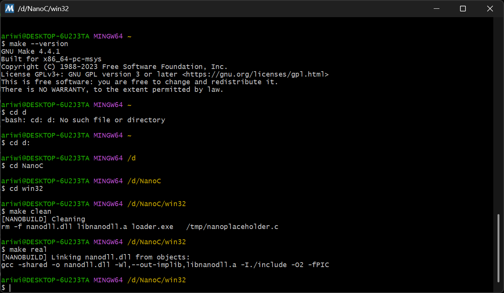
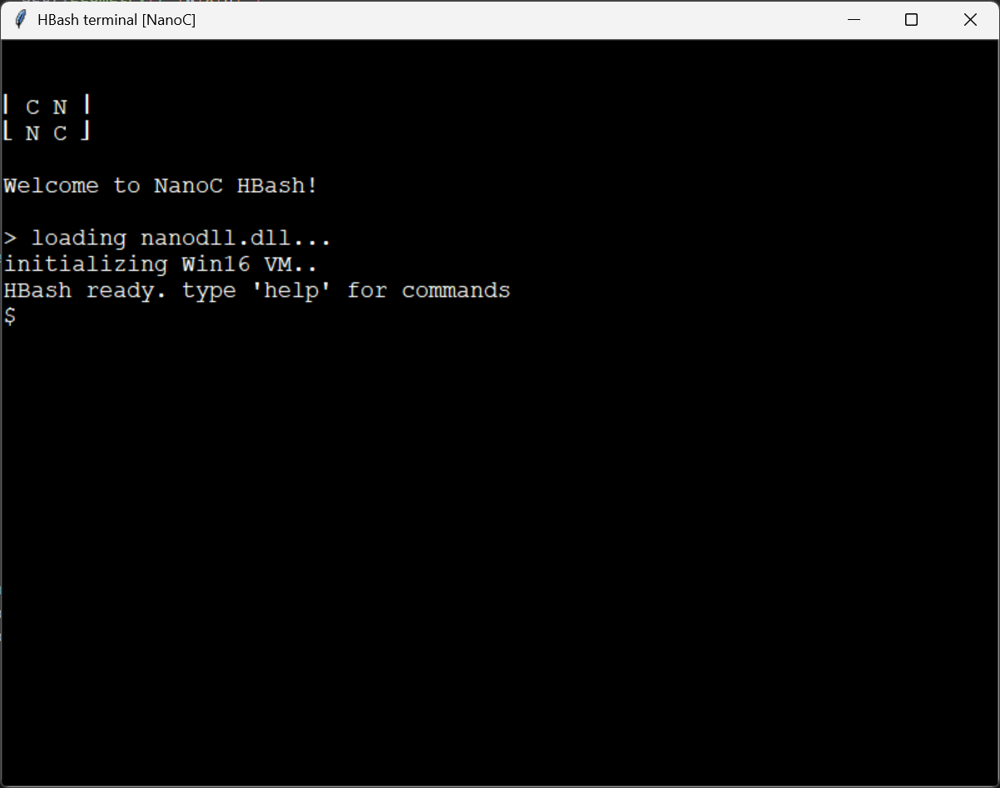
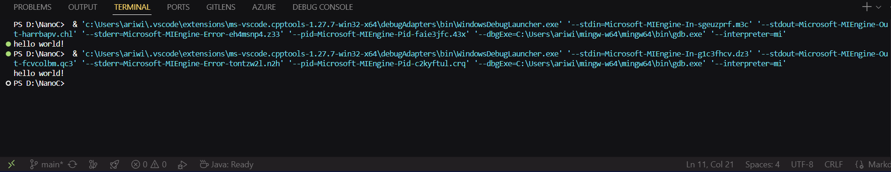

# NanoC

C but smaller, and un-runnable, this is just a **passion project** so dont take it too seriously

## assembler-test

## linker-test

## printf process test

## memory adress test

## nanodll.dll process

## hbash gui simulation

## transpiler simulation

