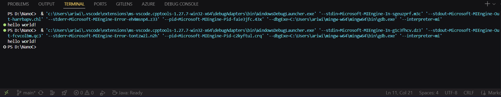

# TRANSPILER

this is the NanoC transpiler, from the simple transpiler.py, it transpiles via using argparse and regex, from hello.nc (the test) to hello.c (the result), and there s also additional test.py for testing the location you're in, which is optional, but why not try it (note: removed)

## result

when you run the python file, it will transpile and do regex filtering from the normal NanoC syntax to C syntax.

## result image

